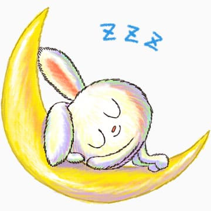

## Welcome to the Bebe World

**Update**: The Bebe world is no more and most likely will be no more. For any bebe to exist, the relationship should be of two equals. When that doesn't happen, things are abusive and problematic in a relationship. See any example in your life of an abusive relationship. You will always find power struggle there by one of the bebes. In our case my (ex) bebe said that she "I literally lost my respect for you even". Note that the "even" in my (ex) bebe's sentence didn't mean that I had lost respect for her. After hearing this sentence, I knew the Bebe World is no more, because it was not said in anger and my (ex) bebe meant it. I will not go in details of what happened because everyone has a version of their story. In my version of the story, Bebe world could have been saved. In my (ex) bebe's version of the story, it couldn't be, and hence we didn't save the bebe world.  

Someone once said that "you will repeat what you don't repair". I felt like I was on the right path all along. Never missed a moment to tell my bebe that I loved her and supported her, etc. On the final day we were arguing about something (it wasn't intense), and then she told me I have been calling her a negative word (lets say sketchy) which felt manipulative to her. I started calling her sketchy once when she did not want to be friends with me on FB, and after that I started it as a joke: Calling her sketchy for everything where we disagreed (she used to laugh). However, now I see how it could be mis-construed as being manipulative. It is in my nature to crack jokes which are funny but have a teeny bit of truth to it, and that hurt her. I believe the lesson learnt is that even if someone laughs at your jokes on their behaviour, do not think of it as a genuine laugh, because inside they could be hurt. So yes, I learnt my lesson, and it shan't be repeated.  

Now to the spicy bits. Do I think my (ex) bebe was wrong? Nope, I don't blame her. Do I think she was sketchy? Nope, but that FB thing is still a mystery. How am I coping up? There's a sort of emptiness I feel everyday, but with time, like everything, this too shall pass. How is my (ex) bebe coping up? No idea! I have absolutely no idea, but I think the (ex) bebe is fine because the (ex) bebe said that she had lost respect for me. In my opinion, when you lose respect for someone, you don't miss them or feel empty, you only feel like a fool for spending time with them.   

Anyway, this was one heck of an experience and something to learn from. With that said, bebe no. 2 signs off forever. We do not hope for an update. Thank you, readers! Btw, only one other person knows this website apart from me and the (ex) bebe. If you are not that other person, and still stumbled on this website, you may have found a gem. See this as an example for how beautiful things can come to an end, how *two people **couldn't** "bhangra" through life*.    


**Statistics $ + $ Linear Algebra $ + ... = $ Awesome $ + $ (Cool)$^n$**  
**\#NetBioMed**  

   

 

 <dl>
  <iframe src="https://www.facebook.com/plugins/video.php?href=https%3A%2F%2Fwww.facebook.com%2Fseerlight%2Fvideos%2F2758646667698539%2F&show_text=0&width=380" width="380" height="476" style="border:none;overflow:hidden" scrolling="no" frameborder="0" allowTransparency="true" allowFullScreen="true"></iframe>  
 </dl>


```python
G = nx.erdos_renyi_graph(20, 0.1)
color_map = []
for node in G:
    if node < 10:
        color_map.append('blue')
    else:
        color_map.append('green')      
nx.draw(G, node_color=color_map, with_labels=True)
plt.show()
```
### Selected Humor with a Hint of Truth at Times
* Modi's radio blabber should be called "Monkey Baat".
* Although I am a mathematician, with by bebe, I don't need to find my x.  
* What is Bruce Lee's favourite flower? Ans: Lily.  
